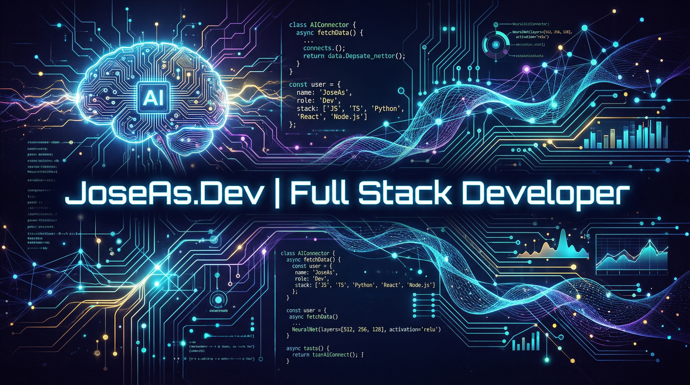

# ¡Hola! Soy José Alberto Apaza (JoseAs.Dev) 🚀

  

### 👨‍💻 Sobre mí
Soy **Full Stack Developer** y **UX/UI Designer** basado en Perú. Me especializo en la creación de ecosistemas **SaaS escalables** y soluciones de alta eficiencia con inteligencia artificial integrada. Mi enfoque combina la robustez del código con una experiencia de usuario impecable.

---

### 💼 Experiencia Destacada
**Desarrollador SaaS Multitenant @ Aynitech (2 años)** Participé activamente en el desarrollo y mantenimiento de un SaaS de alcance internacional.
- **Stack:** Vue.js, NestJS, PostgreSQL.
- **Infraestructura:** AWS (Amazon Web Services).
- **Logros:** Implementación de arquitecturas multitenencia y optimización de flujos de datos complejos.

---

### 🚀 Proyectos Actuales (SaaS Incubator)
Actualmente estoy construyendo tres plataformas SaaS integrando **IA generativa** para potenciar cada flujo de trabajo:

1.  **SaaS Restaurantes Perú:** Sistema integral con facturación y gestión de pedidos.
2.  **ConsultancyFlow:** Gestión de proyectos para consultores de Ingeniería y Arquitectura.
3.  **MedSync Independent:** Plataforma multitenant para profesionales de salud (Psicología, Nutrición, etc.).

**Stack Tecnológico:** `Next.js` • `NestJS` • `TypeScript` • `Docker` • `PostgreSQL` • `JWT Auth` • `AI Integration`

---

### 🛠 Tech Stack & Habilidades

| Backend & DevOps | Frontend & Mobile | Design & No-Code |
| :--- | :--- | :--- |
|    |    |    |

- **Especialidades:** Arquitectura Multitenant, Integración de APIs de IA, SEO Profesional, Automatizaciones para Telegram y WhatsApp.

---

### 🤝 Conectemos
- 🌐 **Sitio Web:** [joseas.dev](https://joseas.dev)
- 💼 **LinkedIn:** [in/jose-apaza-sevilla](https://www.linkedin.com/in/jose-apaza-sevilla)
- 📸 **Instagram:** [@joseas.dev](https://www.instagram.com/joseas.dev)

---

